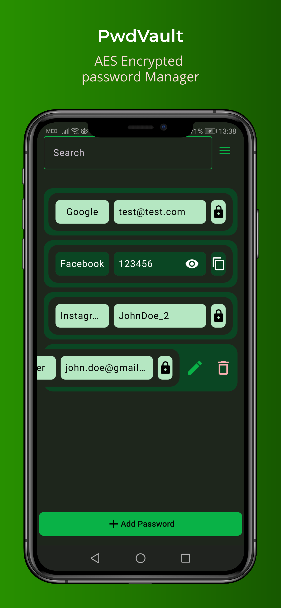
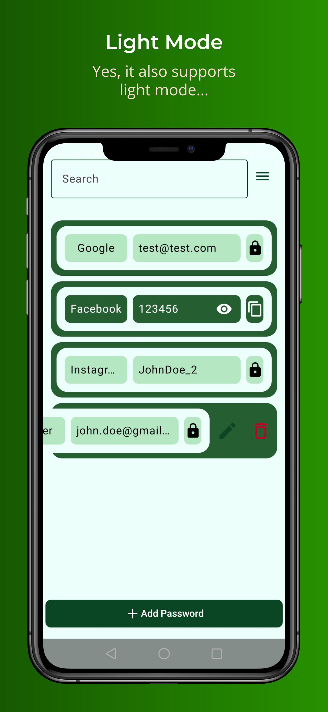
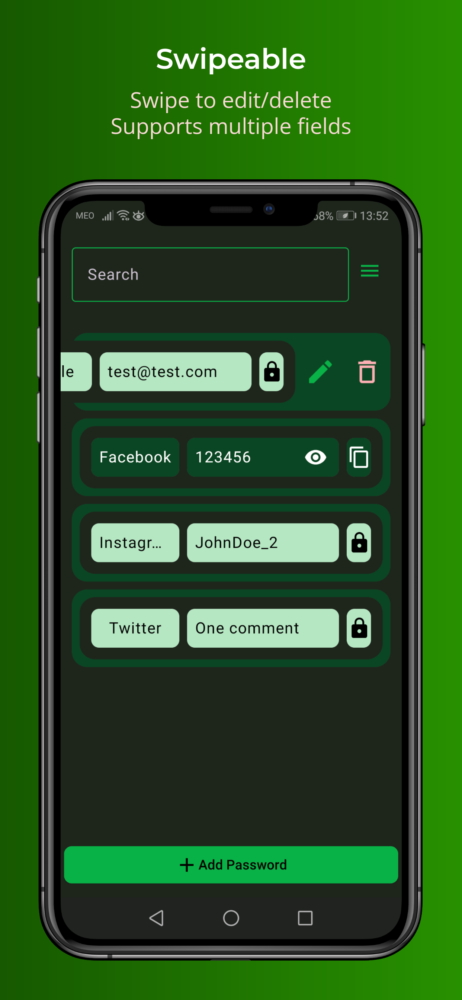

# PwdVault

## Overview

PwdVault is a password management application developed in Kotlin for Android devices.
It allows users to securely store and manage their credentials for various platforms.

<html lang="en">

</html>

## Features

- Secure storage of credentials.
- Easy retrieval of stored credentials.
- Ability to add, edit, and delete credentials.
- Possibility export and import credentials.
- Dark and light theme support.

## Getting Started

These instructions will get you a copy of the project up and running on your local
machine for development and testing purposes.

You can also **download** the APK from the [releases](https://github.com/Initdd/PwdVault/releases) page.

> [!IMPORTANT]
> the default password for the application is `123`

### Prerequisites

- Android Studio Koala | 2024.1.1 or later
- JDK 8 or later
- Android SDK

### Installing

1. Clone the repository: `git clone https://github.com/Initdd/PwdVault`
2. Open the project in Android Studio.
3. Run the application on your emulator or real device.

## Built With

- [Kotlin](https://kotlinlang.org/)
- [Gradle](https://gradle.org/)
- [Android Jetpack](https://developer.android.com/jetpack)

## Requirements

- Android 9.0 (Pie) or later

## Contributing

You can always contribute to this project by submitting a pull request.
